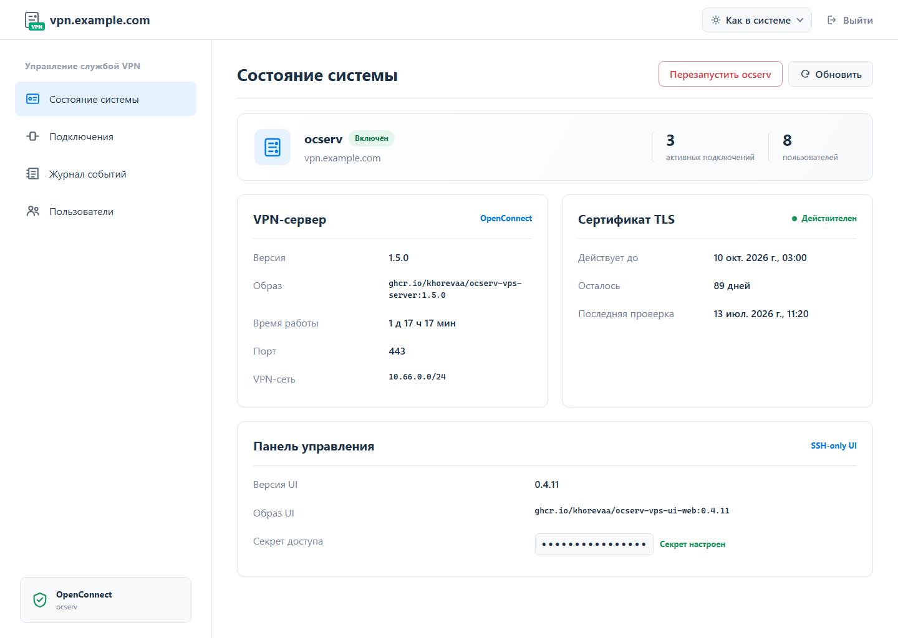
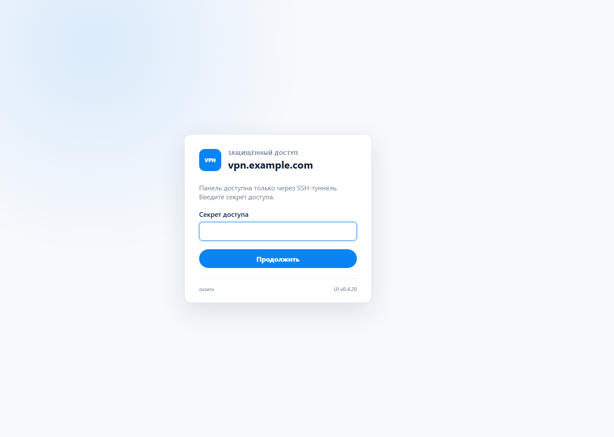
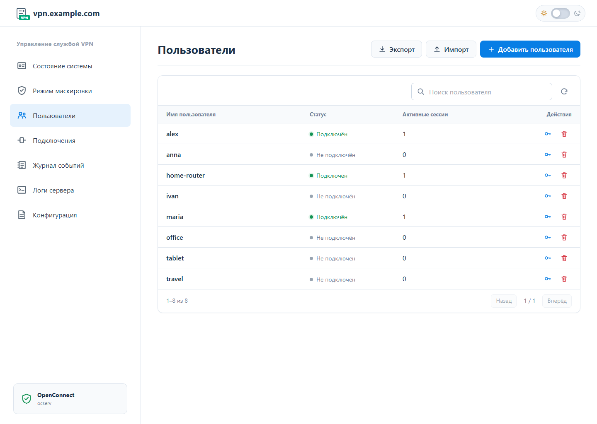

[Русский](README.md) · [English](README_EN.md)

# ocserv-vps

Готовый VPN-сервер на базе [ocserv](https://www.infradead.org/ocserv/) для собственного VPS: установка одной командой, управление пользователями и закрытая веб-панель.



## Возможности

- установка ocserv, Docker и необходимых системных пакетов на чистый Debian или Ubuntu;
- выпуск и автоматическое обновление TLS-сертификата Let's Encrypt;
- создание пользователей с безопасными одноразовыми паролями и вывод начальных VPN-реквизитов после установки;
- просмотр состояния сервера, активных подключений и журнала событий;
- ограниченный журнал VPN: при превышении 4 MiB сохраняются последние 10 000 событий;
- обновление и откат серверного образа без ручного редактирования конфигурации;
- отдельная веб-панель без публичного HTTP-порта и доступа к Docker socket;
- интерактивное меню и команды для автоматизации.

## Требования

- VPS с Debian или Ubuntu и архитектурой `amd64`;
- доступ `root` или возможность выполнить команду через `sudo`;
- домен с A-записью, направленной на публичный IP сервера;
- доступные TCP/UDP-порты VPN и рабочее SSH-подключение.

> Установка меняет правила firewall и перезапускает сетевые сервисы. Не закрывайте текущую SSH-сессию до завершения проверки VPN.

## Быстрая установка

Запустите от `root`:

```bash
bash <(curl -Ls https://raw.githubusercontent.com/khorevaa/ocserv-vps/develop/install.sh)
```

Скрипт определит ОС и архитектуру, установит зависимости и команду `ocserv-vps`, после чего запустит пошаговую настройку сервера.

Для установки без диалогов:

```bash
curl -Ls https://raw.githubusercontent.com/khorevaa/ocserv-vps/develop/install.sh | \
  OCSERV_DOMAIN=vpn.example.com \
  OCSERV_ACME_EMAIL=admin@example.com \
  OCSERV_VPN_USERNAME=vpnuser \
  OCSERV_APPROVE_FIREWALL=1 \
  OCSERV_APPROVE_RESTART=1 \
  bash
```

Если переменная `OCSERV_DOMAIN` не задана и stdin не интерактивен, установится только менеджер. Настройку можно продолжить командой:

```bash
sudo ocserv-vps install
```

Конкретную версию менеджера можно указать аргументом:

```bash
bash <(curl -Ls https://raw.githubusercontent.com/khorevaa/ocserv-vps/develop/install.sh) v0.1.3
```

## Управление

Запустите `sudo ocserv-vps` без аргументов, чтобы открыть интерактивное меню.

| Команда | Назначение |
| --- | --- |
| `ocserv-vps install` | Первичная настройка VPN-сервера |
| `ocserv-vps status` | Состояние сервиса и сертификата |
| `ocserv-vps add-user <имя>` | Создать пользователя |
| `ocserv-vps update` | Обновить серверный образ |
| `ocserv-vps rollback` | Откатить последнее обновление |
| `ocserv-vps install-ui` | Установить веб-панель |
| `ocserv-vps update-ui` | Обновить веб-панель |
| `ocserv-vps ui-access` | Показать секрет и команду SSH-туннеля |
| `ocserv-vps rotate-ui-access` | Сменить секрет доступа к панели |
| `ocserv-vps start\|stop\|restart` | Управлять сервисом |
| `ocserv-vps logs` | Смотреть журналы контейнера |
| `ocserv-vps update-manager [тег]` | Обновить менеджер |
| `ocserv-vps uninstall [--purge-data]` | Удалить установку |

## Веб-панель

Панель позволяет проверить сервер и сертификат, управлять пользователями, видеть активные подключения и завершать выбранные сессии.

На странице состояния можно скопировать доменное имя VPN, готовую SSH-команду подключения к закрытой панели и секрет доступа. Карточка TLS показывает издателя сертификата и позволяет запросить принудительный перевыпуск через Let's Encrypt. Операция выполняется через изолированный системный мост systemd на хосте: контейнер панели по-прежнему работает без сети и сокета Docker.

### Защищённый вход



### Управление пользователями



После создания пользователя или смены пароля панель один раз показывает готовую текстовую конфигурацию подключения: адрес сервера, протокол AnyConnect, имя пользователя и пароль. Её можно скопировать или скачать как `.txt` для передачи на телефон или роутер. Открытый пароль не сохраняется панелью.

Кнопки «Экспорт» и «Импорт» переносят пользователей между установками без смены их паролей. По умолчанию импорт объединяет пользователей с существующим списком; режим полной замены включается отдельно и удаляет отсутствующих в файле пользователей. Экспортированный JSON содержит хеши паролей — храните его как чувствительную резервную копию.

Панель не открывает TCP-порт на VPS. Для доступа выполните:

```bash
sudo ocserv-vps ui-access
```

Команда покажет текущий секрет и готовую команду SSH-туннеля к Unix-сокету `/run/ocserv-ui-web/web.sock`. Секрет обменивается на серверную сессию и не передаётся в URL.

## Контейнерные образы

- `ghcr.io/khorevaa/ocserv-vps-server:<версия-ocserv>`
- `ghcr.io/khorevaa/ocserv-vps-ui-web:<версия-ui>`
- `ghcr.io/khorevaa/ocserv-vps-ui-control:<версия-ui>`

Перед запуском менеджер проверяет версию, исходный репозиторий, компонент, ревизию и совместимость образов. Серверный образ собирается из опубликованного релиза ocserv с проверкой SHA-256 и GPG-подписи.

## Удаление

Обычное удаление сохраняет Docker, сертификаты Let's Encrypt и данные в `/opt/ocserv-vps`:

```bash
sudo ocserv-vps uninstall
```

Чтобы также удалить управляемые данные и резервные копии из `/var/backups/ocserv-vps`, добавьте `--purge-data`.

## Лицензия

Код панели и автоматизации распространяется по лицензии [MIT](LICENSE). Контейнеры ocserv включают исходный проект ocserv под лицензией GPLv2-or-later.
