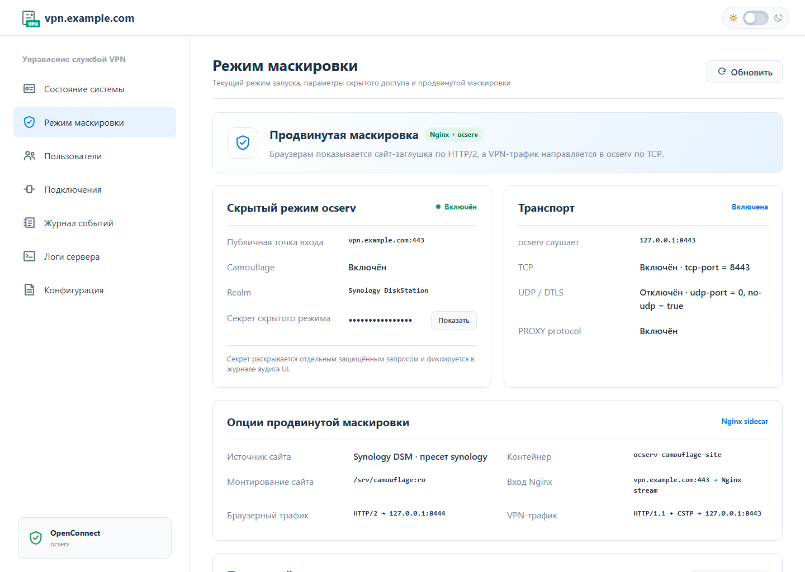
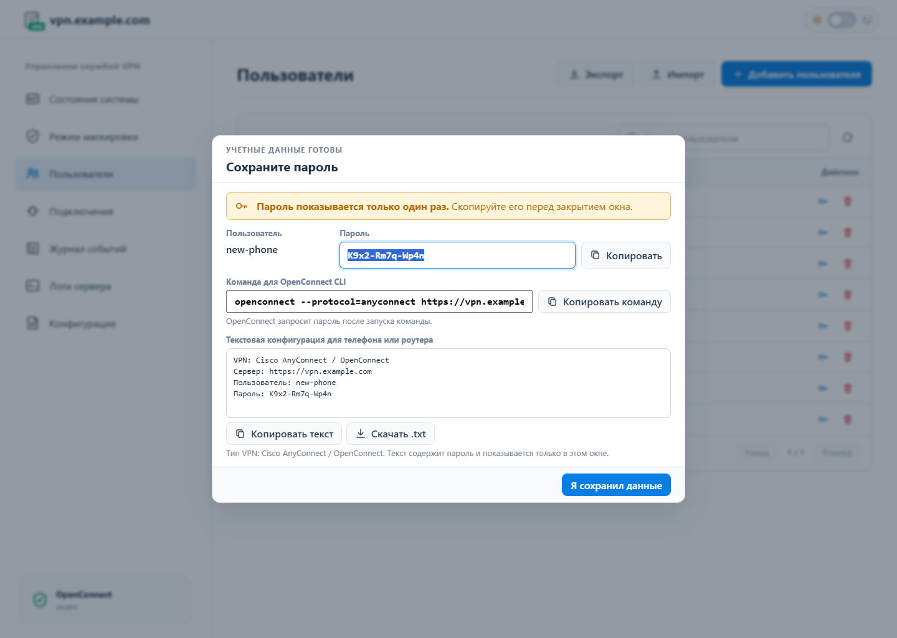
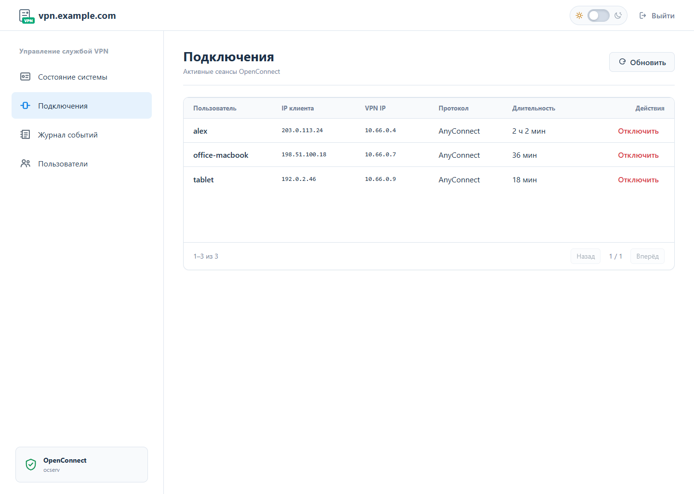
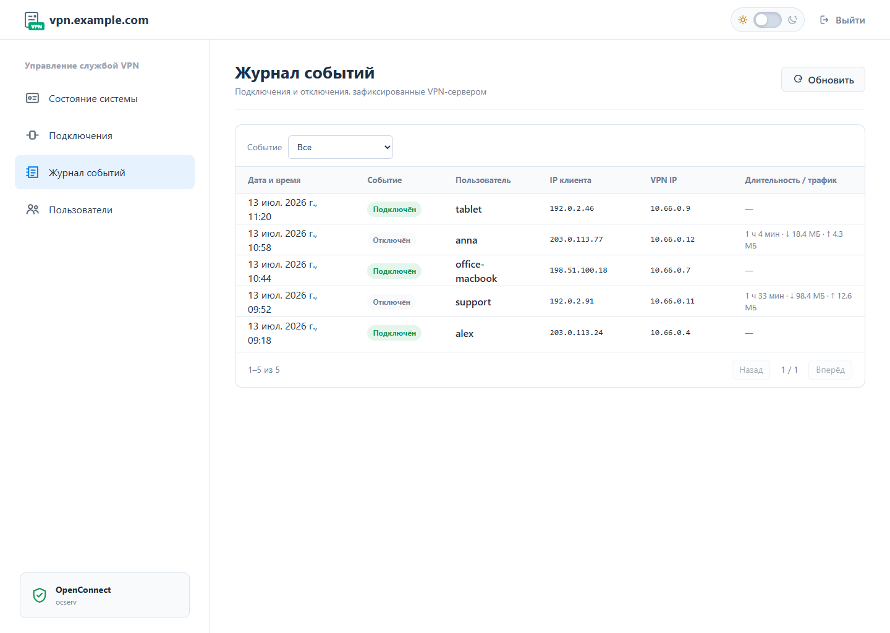
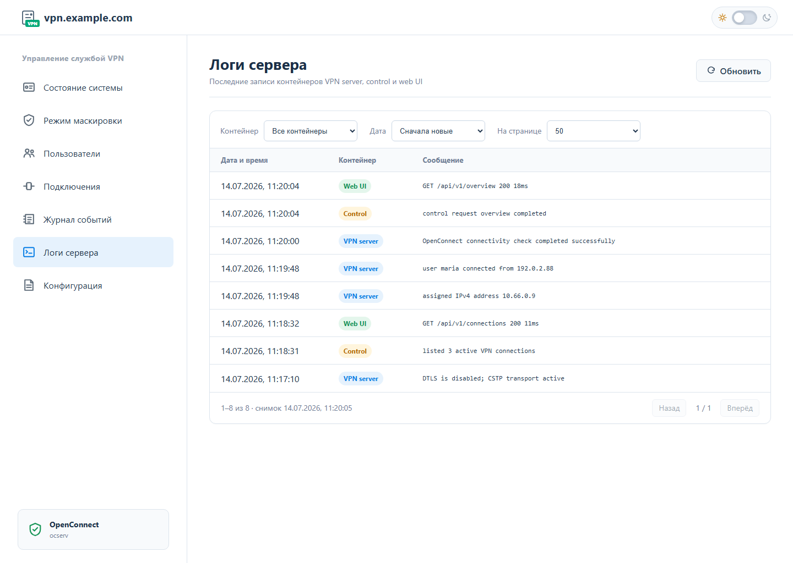
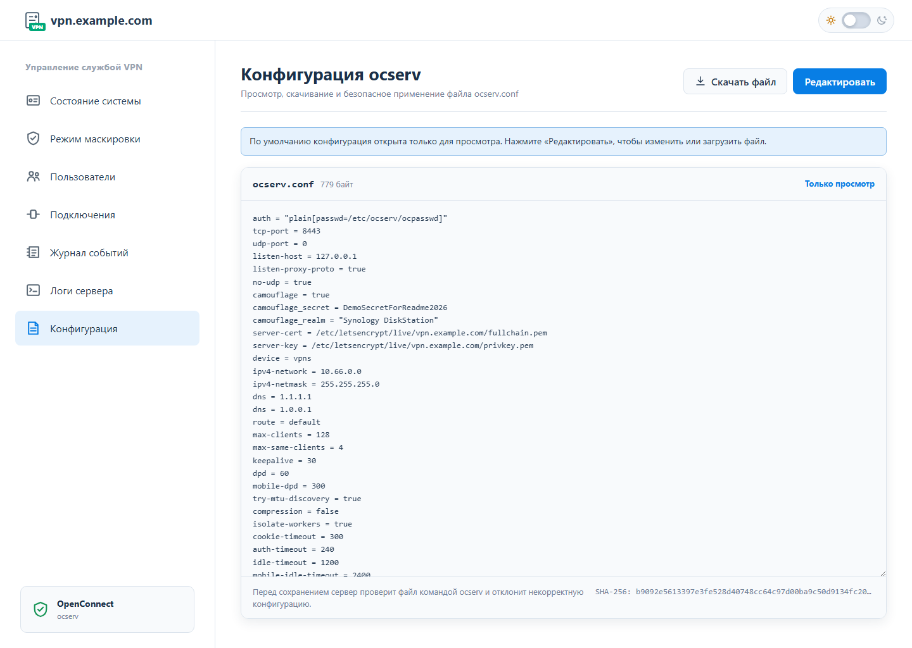

[Русский](README.md) · [English](README_EN.md)

# ocserv-vps

Готовый VPN-сервер на базе [ocserv](https://www.infradead.org/ocserv/) для собственного VPS: установка одной командой, управление пользователями и закрытая веб-панель.


## Возможности

- установка ocserv, Docker и необходимых системных пакетов на чистый Debian или Ubuntu;
- выпуск и автоматическое обновление TLS-сертификата Let's Encrypt;
- нативный и продвинутый режимы Camouflage с локальными сайтами-заглушками;
- создание и удаление пользователей, смена паролей, импорт и экспорт учётных записей;
- одноразовые профили подключения для OpenConnect, телефонов и роутеров;
- просмотр состояния сервера, активных подключений, журнала событий и постраничных логов контейнеров;
- ограниченный журнал VPN: при превышении 4 MiB сохраняются последние 10 000 событий;
- просмотр, скачивание и безопасное редактирование `ocserv.conf` с проверкой перед перезапуском;
- обновление и откат серверного образа без ручного редактирования конфигурации;
- отдельная веб-панель без публичного HTTP-порта и доступа к Docker socket;
- интерактивное меню и команды для автоматизации.

## Требования

- VPS с Debian или Ubuntu и архитектурой `amd64`;
- доступ `root` или возможность выполнить команду через `sudo`;
- домен с A-записью, направленной на публичный IP сервера;
- доступные порты VPN и рабочее SSH-подключение; продвинутая маскировка требует TCP/443 и отключает UDP/DTLS.

> Установка меняет правила firewall и перезапускает сетевые сервисы. Не закрывайте текущую SSH-сессию до завершения проверки VPN.

## Быстрая установка

Запустите от `root`:

```bash
bash <(curl -Ls https://raw.githubusercontent.com/khorevaa/ocserv-vps/develop/install.sh)
```

Скрипт определит ОС и архитектуру, установит зависимости и команду `ocserv-vps`, после чего запустит пошаговую настройку сервера.

Для установки без диалогов:

```bash
curl -Ls https://raw.githubusercontent.com/khorevaa/ocserv-vps/develop/install.sh | \
  OCSERV_DOMAIN=vpn.example.com \
  OCSERV_ACME_EMAIL=admin@example.com \
  OCSERV_VPN_USERNAME=vpnuser \
  OCSERV_CAMOUFLAGE=1 \
  OCSERV_CAMOUFLAGE_REALM='Test Environment' \
  OCSERV_ADVANCED_CAMOUFLAGE=0 \
  OCSERV_APPROVE_FIREWALL=1 \
  OCSERV_APPROVE_RESTART=1 \
  bash
```

Этот пример устанавливает нативную маскировку ocserv. Чтобы установить сервер без маскировки, задайте `OCSERV_CAMOUFLAGE=0` и не передавайте остальные параметры маскировки. Для продвинутого режима используйте пример ниже.

Если переменная `OCSERV_DOMAIN` не задана и stdin не интерактивен, установится только менеджер. Настройку можно продолжить командой:

```bash
sudo ocserv-vps install
```

### Camouflage

Во время интерактивной установки можно включить Camouflage. Установщик запросит HTTP realm (по умолчанию `Test Environment`), который ocserv показывает посторонним запросам, а VPN-клиенту потребуется адрес вида `https://vpn.example.com:443/?секрет`. Секрет выводится только в составе чувствительных VPN-реквизитов и сохраняется в защищённой конфигурации сервера.

Для установки без диалогов задайте `OCSERV_CAMOUFLAGE=1`. Переменная `OCSERV_CAMOUFLAGE_SECRET` необязательна: если её не задать, будет создан случайный 32-символьный секрет. `OCSERV_CAMOUFLAGE_REALM` по умолчанию равна `Test Environment`. Для секрета допустимы 16–128 URL-безопасных символов: латинские буквы, цифры, `.`, `_`, `~`, `-`.

| Переменная `install.sh` | Назначение |
| --- | --- |
| `OCSERV_CAMOUFLAGE=0\|1` | Отключить маскировку или включить нативный Camouflage |
| `OCSERV_CAMOUFLAGE_SECRET` | Необязательный секрет; при отсутствии генерируется автоматически |
| `OCSERV_CAMOUFLAGE_REALM` | Realm нативного или пользовательского режима; для встроенного пресета берётся из `camouflage.json` |
| `OCSERV_ADVANCED_CAMOUFLAGE=0\|1` | Включить продвинутый TCP-only режим; требует `OCSERV_CAMOUFLAGE=1` |
| `OCSERV_CAMOUFLAGE_SITE_TEMPLATE` | Пресет `synology`, `owncloud`, `workspace` или `custom` |
| `OCSERV_CAMOUFLAGE_SITE_URL` | Прямая HTTPS-ссылка на заглушку; только для пресета `custom` |

```bash
OCSERV_CAMOUFLAGE=1 \
OCSERV_CAMOUFLAGE_SECRET=replace-with-a-long-secret \
OCSERV_CAMOUFLAGE_REALM='Test Environment' \
sudo -E ocserv-vps install
```

#### Продвинутая маскировка сайтом

После включения обычного Camouflage установщик может включить продвинутый TCP-only режим и предложит выбрать заглушку. Отдельный Nginx-контейнер `ocserv-camouflage-site` занимает публичный TCP/443 через host networking: браузеры с HTTP/2 получают выбранный сайт, а OpenConnect/AnyConnect по HTTP/1.1 передаётся контейнеру `ocserv-vps` на `127.0.0.1:8443`. TLS до ocserv не завершается на Nginx, реальный IP клиента передаётся через PROXY protocol, а секрет из URL продолжает проверять сам ocserv.

Доступны три встроенных пресета: `synology`, `owncloud` и `workspace`. По их контрактам `camouflage.json` генерируются точные локальные маршруты Nginx для страниц входа, характерных фоновых запросов и фиксированных ответов формы без передачи введённых данных. Четвёртый вариант `custom` скачивает пользовательскую заглушку по `OCSERV_CAMOUFLAGE_SITE_URL`. Это ссылка на файл для однократного скачивания при установке, а не адрес reverse proxy. Поддерживаются ZIP, TAR/TAR.GZ и отдельный HTML-файл с корневым `index.html`.

```bash
OCSERV_CAMOUFLAGE=1 \
OCSERV_ADVANCED_CAMOUFLAGE=1 \
OCSERV_CAMOUFLAGE_SITE_TEMPLATE=synology \
sudo -E ocserv-vps install
```

Сгенерированная конфигурация Nginx и выбранный сайт монтируются в `ocserv-camouflage-site` только для чтения при запуске Compose. Официальный образ Nginx во время установки разрешается в неизменяемый digest и сохраняется в защищённом окружении стека.

Для наиболее продвинутого пользовательского варианта:

```bash
OCSERV_CAMOUFLAGE=1 \
OCSERV_ADVANCED_CAMOUFLAGE=1 \
OCSERV_CAMOUFLAGE_SITE_TEMPLATE=custom \
OCSERV_CAMOUFLAGE_SITE_URL='https://downloads.example/vpn-cover.zip' \
sudo -E ocserv-vps install
```

Custom URL должен возвращать файл напрямую по HTTPS без redirect, не содержать credentials/fragment и разрешаться только в публичные IPv4-адреса, отличные от VPN endpoint. Размер скачивания и распакованного сайта ограничен 10 MiB и 1000 файлами; ссылки, специальные файлы и небезопасные пути в архиве отклоняются. URL не сохраняется в Nginx или state. Используйте только сайт, который вы вправе размещать.

В этом режиме UDP/DTLS намеренно отключён полностью: UDP/443 не открывается в firewall, а ocserv получает `udp-port = 0` и `no-udp = true`, поэтому не создаёт даже локальный UDP-listener. Режим требует публичный порт `443`.

Маршрутизация браузера основана на ALPN HTTP/2. HTTP/1.1-браузер или специально сформированный probe попадёт на нативный ответ Camouflage ocserv (404/401), поэтому режим повышает правдоподобность обычного посещения, но не обещает неотличимость от веб-сервера при активном анализе.

Конкретную версию менеджера можно указать аргументом:

```bash
bash <(curl -Ls https://raw.githubusercontent.com/khorevaa/ocserv-vps/develop/install.sh) v0.1.15
```

## Управление

Запустите `sudo ocserv-vps` без аргументов, чтобы открыть интерактивное меню.

| Команда | Назначение |
| --- | --- |
| `ocserv-vps install` | Первичная настройка VPN-сервера |
| `ocserv-vps status` | Состояние сервиса и сертификата |
| `ocserv-vps add-user <имя>` | Создать пользователя |
| `ocserv-vps update` | Обновить серверный образ |
| `ocserv-vps rollback` | Откатить последнее обновление |
| `ocserv-vps install-ui` | Установить веб-панель |
| `ocserv-vps update-ui` | Обновить веб-панель |
| `ocserv-vps ui-access` | Показать секрет и команду SSH-туннеля |
| `ocserv-vps rotate-ui-access` | Сменить секрет доступа к панели |
| `ocserv-vps start\|stop\|restart` | Управлять сервисом |
| `ocserv-vps logs` | Смотреть журналы контейнера |
| `ocserv-vps update-manager [тег]` | Обновить менеджер |
| `ocserv-vps uninstall [--purge-data]` | Удалить установку |

## Веб-панель

Панель показывает состояние сервера и Camouflage, управляет пользователями, завершает выбранные VPN-сессии, выводит журналы контейнеров и позволяет безопасно редактировать `ocserv.conf`.

На странице состояния можно скопировать доменное имя VPN, готовую SSH-команду подключения к закрытой панели и секрет доступа. Карточка TLS показывает издателя сертификата и позволяет запросить принудительный перевыпуск через Let's Encrypt. Хостовые операции и сбор логов выполняются через изолированные systemd-мосты с ограниченным набором действий: контейнеры панели по-прежнему работают без сети и сокета Docker.

### Защищённый вход


### Состояние системы


### Режим маскировки



Раздел показывает публичную точку входа, состояние TCP и UDP/DTLS, маршрут через Nginx и выбранный источник сайта-заглушки. Секрет Camouflage раскрывается только отдельным защищённым запросом, который записывается в журнал аудита UI.

### Управление пользователями


Пользователя можно создать, удалить или выдать ему новый пароль; при удалении панель также завершает активные сессии. Кнопки «Экспорт» и «Импорт» переносят пользователей между установками без смены их паролей. По умолчанию импорт объединяет пользователей с существующим списком; режим полной замены включается отдельно и удаляет отсутствующих в файле пользователей. Экспортированный JSON содержит хеши паролей — храните его как чувствительную резервную копию.

После создания пользователя или смены пароля панель один раз показывает пароль, команду OpenConnect CLI и готовую текстовую конфигурацию для телефона или роутера. Открытый пароль не сохраняется панелью.



### Активные подключения



### Журнал событий



### Логи сервера



Снимок логов контейнеров VPN server, Control и Web UI можно фильтровать по источнику, сортировать по времени и просматривать постранично. Панели не нужен доступ к Docker socket.

### Конфигурация ocserv



По умолчанию `ocserv.conf` открыт только для просмотра. Файл можно скачать, отредактировать или загрузить заново; перед атомарной заменой панель проверяет ревизию и синтаксис, а при неудачном перезапуске восстанавливает предыдущую конфигурацию.

Панель не открывает TCP-порт на VPS. Для доступа выполните:

```bash
sudo ocserv-vps ui-access
```

Команда покажет текущий секрет и готовую команду SSH-туннеля к Unix-сокету `/run/ocserv-ui-web/web.sock`. SSH target указывается внешним IPv4-адресом VPS, полученным из A-записи VPN-домена при установке или обновлении UI. Секрет обменивается на серверную сессию и не передаётся в URL.

## Контейнерные образы

- `ghcr.io/khorevaa/ocserv-vps-server:<версия-ocserv>`
- `ghcr.io/khorevaa/ocserv-vps-ui-web:<версия-ui>`
- `ghcr.io/khorevaa/ocserv-vps-ui-control:<версия-ui>`

Перед запуском менеджер проверяет версию, исходный репозиторий, компонент, ревизию и совместимость образов. Серверный образ собирается из опубликованного релиза ocserv с проверкой SHA-256 и GPG-подписи.

## Удаление

Обычное удаление сохраняет Docker, сертификаты Let's Encrypt и данные в `/opt/ocserv-vps`:

```bash
sudo ocserv-vps uninstall
```

Чтобы также удалить управляемые данные и резервные копии из `/var/backups/ocserv-vps`, добавьте `--purge-data`.

## Лицензия

Код панели и автоматизации распространяется по лицензии [MIT](LICENSE). Контейнеры ocserv включают исходный проект ocserv под лицензией GPLv2-or-later.
